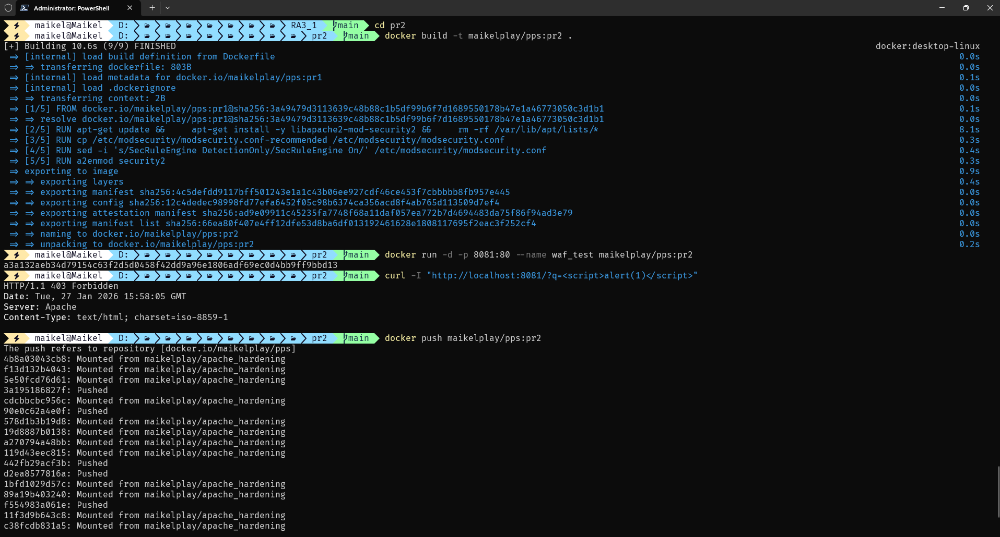
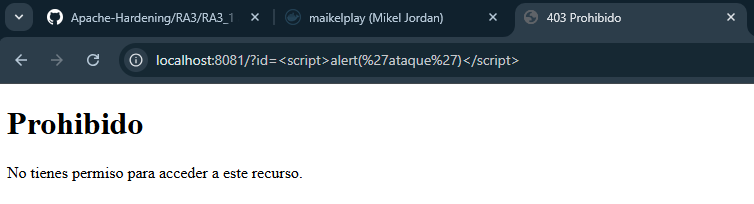

<div align="center">


</div>

<div align="center">


</div>

<div align="center">

[](https://github.com/MaikelPlay/Apache-Hardening)
[](https://hub.docker.com/r/maikelplay/pps)

</div>

# Práctica 2: Web Application Firewall (WAF)

En esta segunda fase, mejoramos el servidor endurecido de la Práctica 1 añadiendo una capa de seguridad activa: un **WAF (Web Application Firewall)** basado en **ModSecurity**. El objetivo es proteger la aplicación en la Capa 7 (Aplicación) detectando y bloqueando ataques comunes como **Cross-Site Scripting (XSS)** antes de que sean procesados por el servidor web.

---

## 📂 Estructura del directorio

A diferencia de implementaciones complejas, hemos optimizado la estructura para que toda la configuración resida en el Dockerfile, manteniendo el repositorio limpio:

```text
Practica2_WAF/
└── Dockerfile      # Instalación y configuración de ModSecurity
```

##  Configuración Realizada

Para llegar al estado final de seguridad, se realizaron las siguientes acciones técnicas:

### A. Instalación del Motor
Se ha instalado el motor de ModSecurity sobre la imagen base de la práctica anterior.
* **Paquete**: `libapache2-mod-security2`
* **Optimización**: Limpieza inmediata de caché apt para reducir el peso de la imagen.

### B. Activación del Motor de Bloqueo
Por defecto, ModSecurity se instala en modo de solo detección (DetectionOnly). Hemos automatizado el cambio a modo Bloqueo directamente en la construcción:
* **Comando**: `sed -i 's/SecRuleEngine DetectionOnly/SecRuleEngine On/' ...`
* **Efecto**: El servidor pasa de solo "avisar" a "bloquear" (403 Forbidden) cualquier petición maliciosa.

### C. Herencia de Seguridad
Al utilizar la instrucción FROM maikelplay/pps:pr1, el contenedor mantiene automáticamente todas las capas de protección implementadas anteriormente:
* **Hardening de Apache** (ServerTokens, ServerSignature).
* **Cabeceras CSP** (Content Security Policy).
* **Listado de directorios deshabilitado**.

---

##  Dockerfile

El archivo de construcción automatiza la instalación del WAF sobre la base endurecida de la etapa anterior.


```dockerfile
# 1. HERENCIA: Usamos la imagen validada de la Práctica 1
FROM maikelplay/pps:pr1

# 2. INSTALACIÓN: Instalamos ModSecurity y limpiamos temporales
RUN apt-get update && \
    apt-get install -y libapache2-mod-security2 && \
    rm -rf /var/lib/apt/lists/*

# 3. CONFIGURACIÓN: Preparamos el archivo de configuración base
RUN cp /etc/modsecurity/modsecurity.conf-recommended /etc/modsecurity/modsecurity.conf

# 4. HARDENING (CRÍTICO): Cambio a modo "Bloqueo" (SecRuleEngine On)
RUN sed -i 's/SecRuleEngine DetectionOnly/SecRuleEngine On/' /etc/modsecurity/modsecurity.conf

# 5. ACTIVACIÓN: Habilitamos el módulo en Apache
RUN a2enmod security2

EXPOSE 80
```

## Despliegue (Bash Scripts)
A continuación se muestra el proceso de construcción de la imagen (tag pr2) y el arranque del contenedor en el puerto 8081.



### Comandos de Construcción y Ejecución
```bash
# 1. Construir la imagen
docker build -t maikelplay/pps:pr2 .

# 2. Arrancar el contenedor WAF en el puerto 8081
docker run -d -p 8081:80 --name waf_test maikelplay/pps:pr2
```

##  Validación Técnica
Para verificar que el WAF protege el servidor, simulamos un ataque de XSS (Cross-Site Scripting) inyectando código JavaScript en la URL.

### Prueba de Ataque (XSS)
Intentamos ejecutar un script de alerta (<script>alert(1)</script>) a través de la URL.
```bash
curl -I "http://localhost:8081/?q=<script>alert(1)</script>"
```

### Resultado de Seguridad
El servidor intercepta el patrón malicioso y deniega el acceso con un código 403 Forbidden.



* ✅ **Petición Limpia**: http://localhost:8081 -> **200 OK**.
* ✅ **Petición Maliciosa**: http://localhost:8081/?q=<script>... -> 403 Forbidden (Bloqueado por ModSecurity). 

## 🌐 Docker Hub
Imagen disponible para su descarga

| Campo | Valor |
| :--- | :--- |
| **Repositorio** | `maikelplay/pps` |
| **Etiqueta (Tag)** | `pr2` |
| **Comando Pull** | `docker pull maikelplay/pps:pr2` |

---
<div align="center">
    <p>Desarrollado con ❤️ por <b>MaikelPlay</b></p>
    <a href="https://github.com/MaikelPlay">
        
    </a>
    <a href="https://hub.docker.com/u/maikelplay">
        
    </a>
    <a href="https://www.linkedin.com/in/mikel-jordan-moral/">
    
</a>

<a href="https://maikelplay.github.io/portfolio-web/">
    
</a>
</div>
