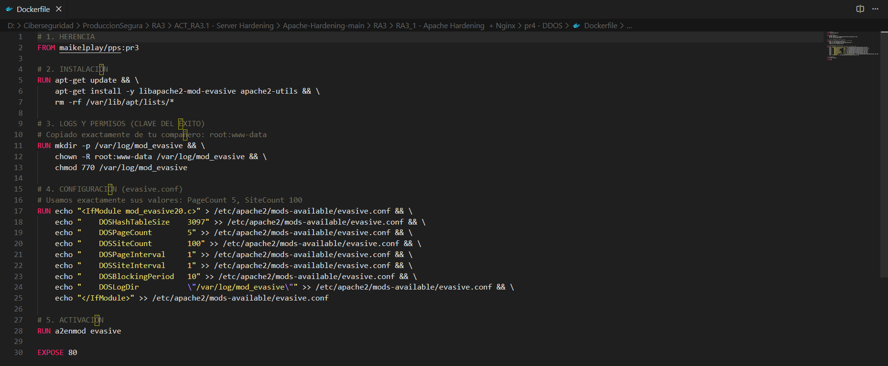
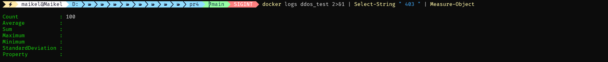

<div align="center">


</div>

<div align="center">


</div>

<div align="center">

[](https://github.com/MaikelPlay/Apache-Hardening)
[](https://hub.docker.com/r/maikelplay/pps)

</div>

# Práctica 4: Protección Anti-DDOS (ModEvasive)

En esta fase añadimos una capa de protección contra ataques de **Denegación de Servicio (DoS)** y fuerza bruta HTTP. Utilizamos **ModEvasive**, un módulo de Apache que rastrea las direcciones IP entrantes y bloquea temporalmente aquellas que exceden los límites de solicitud configurados, garantizando la disponibilidad del servicio ante tráfico abusivo.

---

## 📂 Estructura del directorio

Continuamos con la estrategia de **Infraestructura como Código (IaC)** puramente en el Dockerfile, integrando la configuración del módulo anti-ddos sin archivos externos:

```text
Practica4_DDOS/
└── Dockerfile      # Instalación y configuración de ModEvasive
```

##  Configuración Realizada

Se han implementado las siguientes medidas técnicas para detectar y mitigar ataques volumétricos:

### A. Instalación de Herramientas
Se ha instalado libapache2-mod-evasive junto con apache2-utils (para disponer de la herramienta de estrés ab).

### B. Gestión de Logs y Permisos
Un punto crítico para que ModEvasive funcione es el directorio de logs. Se creó /var/log/mod_evasive y se asignaron permisos específicos (root:www-data con chmod 770) para permitir que Apache escriba los bloqueos sin comprometer la seguridad del sistema.

### C. Configuración de Umbrales (Hardening)
Se inyectó una configuración estricta en evasive.conf para bloquear ataques rápidos:

* **DOSPageCount 5**: Bloquea si la misma IP pide la misma página más de 5 veces en el intervalo.

* **DOSSiteCount 100**: Bloquea si la misma IP hace más de 100 peticiones a cualquier parte del sitio.

* **DOSBlockingPeriod 10**: Si se detecta un ataque, la IP se bloquea (403 Forbidden) durante 10 segundos.

---

##  Dockerfile

El código muestra la instalación del módulo, la corrección de permisos de logs y la inyección de los parámetros de umbral.



```dockerfile
# 1. HERENCIA: Partimos de la imagen con OWASP CRS (Práctica 3)
FROM maikelplay/pps:pr3

# 2. INSTALACIÓN: ModEvasive y herramientas de testing (ab)
RUN apt-get update && \
    apt-get install -y libapache2-mod-evasive apache2-utils && \
    rm -rf /var/lib/apt/lists/*

# 3. LOGS Y PERMISOS (CLAVE DEL ÉXITO)
# Creamos el directorio de logs y damos permisos al grupo www-data
RUN mkdir -p /var/log/mod_evasive && \
    chown -R root:www-data /var/log/mod_evasive && \
    chmod 770 /var/log/mod_evasive

# 4. CONFIGURACIÓN (evasive.conf)
# Inyectamos la configuración de umbrales directamente
RUN echo "<IfModule mod_evasive20.c>" > /etc/apache2/mods-available/evasive.conf && \
    echo "  DOSHashTableSize    3097" >> /etc/apache2/mods-available/evasive.conf && \
    echo "  DOSPageCount        5"    >> /etc/apache2/mods-available/evasive.conf && \
    echo "  DOSSiteCount        100"  >> /etc/apache2/mods-available/evasive.conf && \
    echo "  DOSPageInterval     1"    >> /etc/apache2/mods-available/evasive.conf && \
    echo "  DOSSiteInterval     1"    >> /etc/apache2/mods-available/evasive.conf && \
    echo "  DOSBlockingPeriod   10"   >> /etc/apache2/mods-available/evasive.conf && \
    echo "  DOSLogDir           \"/var/log/mod_evasive\"" >> /etc/apache2/mods-available/evasive.conf && \
    echo "</IfModule>" >> /etc/apache2/mods-available/evasive.conf

# 5. ACTIVACIÓN
RUN a2enmod evasive

EXPOSE 80
```

## Despliegue
Construcción de la imagen (pr4) y ejecución.

### Comandos de Construcción y Ejecución
```bash
# 1. Construir la imagen
docker build -t maikelplay/pps:pr4 .

# 2. Arrancar contenedor
docker run -d -p 8083:80 --name ddos_test maikelplay/pps:pr4
```

## Validación Técnica
Para comprobar la eficacia del sistema Anti-DDOS, utilizamos ApacheBench (ab) para simular un ataque de tráfico intenso desde una única IP.

### 1. Ejecución del Ataque
Lanzamos 100 peticiones concurrentes al servidor:
* `docker exec -it ddos_test ab -n 100 -c 5 http://localhost/index.html`

### 2. Resultado del Benchmark
Como se observa en la captura, ModEvasive entra en acción inmediatamente.
* **Non-2xx responses: 100**. Esto indica que tras superar el umbral inicial, todas las peticiones subsiguientes fueron rechazadas por el servidor.


### 3. Verificación de Logs (Código 403)
Consultamos los logs del contenedor para confirmar que el rechazo se debe a un código de estado 403 Forbidden (Acceso Denegado), confirmando el bloqueo activo de la IP atacante.

* **docker logs ddos_test 2>&1 | Select-String " 403 " | Measure-Object**

**Resultado**: Se contabilizan **100 eventos de bloqueo**, validando la protección total.



## 🌐 Docker Hub
Imagen disponible para su descarga

| Campo | Valor |
| :--- | :--- |
| **Repositorio** | `maikelplay/pps` |
| **Etiqueta (Tag)** | `pr4` |
| **Comando Pull** | `docker pull maikelplay/pps:pr4` |

---
<div align="center">
    <p>Desarrollado con ❤️ por <b>MaikelPlay</b></p>
    <a href="https://github.com/MaikelPlay">
        
    </a>
    <a href="https://hub.docker.com/u/maikelplay">
        
    </a>
    <a href="https://www.linkedin.com/in/mikel-jordan-moral/">
    
</a>

<a href="https://maikelplay.github.io/portfolio-web/">
    
</a>
</div>
