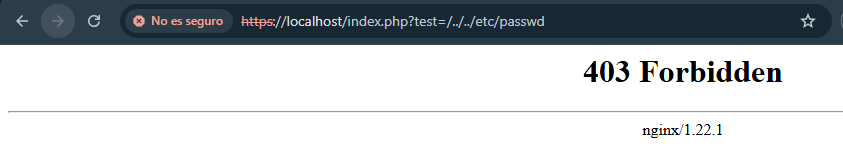

<div align="center">


</div>

<div align="center">


</div>

<div align="center">

[](https://github.com/MaikelPlay/Apache-Hardening)
[](https://hub.docker.com/r/maikelplay/pps)

</div>

# Práctica 5: Arquitectura Segura NGINX (All-in-One)

En esta práctica final realizamos un cambio arquitectónico mayor: migramos de Apache a **NGINX** con **PHP-FPM**. Implementamos un entorno de "Producción Segura" desde cero, integrando en una sola construcción todas las capas de defensa: WAF con reglas OWASP, cifrado SSL/TLS, autenticación básica y cabeceras de seguridad estrictas (HSTS).

---

## 📂 Estructura del directorio

El proyecto requiere inyectar la configuración del servidor virtual (vhost) dentro del contenedor:

```text
Practica5_NGINX/
├── Dockerfile      # Construcción desde Debian Bookworm
└── default         # Configuración del sitio NGINX (SSL, WAF, Auth)
```

## Configuración Realizada

A diferencia de las prácticas anteriores, aquí no se hereda de una imagen preconfigurada. Se ha construido un entorno seguro desde cero basado en `debian:bookworm`, aplicando las siguientes capas de defensa:

### 1. Web Application Firewall (WAF) en NGINX
Se instaló el módulo `libnginx-mod-http-modsecurity` y se integró manualmente el **OWASP Core Rule Set (CRS)**.
* **Integración**: Se configuró Nginx para cargar las reglas de detección de ataques mediante la directiva `modsecurity_rules_file`.
* **Modo Bloqueo**: Se estableció `SecRuleEngine On` para asegurar que las peticiones maliciosas sean denegadas (403) instantáneamente.

### 2. Cifrado SSL y Hardening HSTS
Se implementó una arquitectura "HTTPS Only" para garantizar la confidencialidad de los datos.
* **Certificados**: Generación de claves RSA de 2048 bits (`nginx.crt` y `nginx.key`) mediante OpenSSL durante la construcción de la imagen.
* **Redirección Forzada**: Todo tráfico entrante por el puerto 80 es redirigido automáticamente al 443 (HTTPS) mediante un código 301.
* **HSTS**: Se inyectó la cabecera `Strict-Transport-Security` para proteger contra ataques de *SSL Stripping* y *Downgrade*.

### 3. Autenticación y Control de Acceso
* **Zona Restringida**: Se protegió la ruta `/privado` requiriendo autenticación de usuario.
* **Mecanismo**: Uso de `auth_basic` vinculado a un archivo `.htpasswd` generado para el usuario `maikel`.

### 4. Minimización y CSP
* **Ocultación**: Se configuró `server_tokens off;` para impedir que Nginx revele su versión en las cabeceras HTTP.
* **Content Security Policy**: Se aplicó la directiva `default-src 'self'` para restringir la carga de scripts y recursos únicamente al propio dominio, mitigando ataques XSS.

---

## Dockerfile y Configuración

El despliegue se basa en dos archivos críticos: el script de construcción (`Dockerfile`) y la configuración del servidor virtual (`default`) que se inyecta en la imagen.

### 1. El Dockerfile (Construcción)
Instala Nginx, PHP-FPM, descarga las reglas OWASP, configura el WAF en modo bloqueo y genera los certificados SSL autofirmados.


```dockerfile
FROM debian:bookworm

# Evitar preguntas interactivas durante la instalación
ENV DEBIAN_FRONTEND=noninteractive

# 1. INSTALACIÓN DE PAQUETES
# Incluimos nginx, módulo WAF, php-fpm, openssl y herramientas
RUN apt-get update && apt-get install -y \
    nginx \
    libnginx-mod-http-modsecurity \
    php-fpm \
    openssl \
    apache2-utils \
    git \
    && apt-get clean

# 2. INSTALAR REGLAS OWASP (Core Rule Set)
# Clonamos el repositorio oficial en la ruta de configuración
RUN git clone [https://github.com/coreruleset/coreruleset.git](https://github.com/coreruleset/coreruleset.git) /etc/nginx/modsec/owasp-crs

# Movemos el archivo de configuración de ejemplo
RUN cp /etc/nginx/modsec/owasp-crs/crs-setup.conf.example /etc/nginx/modsec/owasp-crs/crs-setup.conf

# 3. CREAR ARCHIVO MODSECURITY.CONF
# Activamos el motor (SecRuleEngine On) e incluimos las reglas OWASP
RUN echo "SecRuleEngine On\n\
SecRequestBodyAccess On\n\
SecResponseBodyAccess On\n\
SecResponseBodyMimeType text/plain text/html text/xml\n\
SecDataDir /tmp\n\
# Carga de configuración OWASP y reglas\n\
Include /etc/nginx/modsec/owasp-crs/crs-setup.conf\n\
Include /etc/nginx/modsec/owasp-crs/rules/*.conf" > /etc/nginx/modsec/modsecurity.conf

# 4. CERTIFICADOS SSL (Autofirmados)
RUN openssl req -x509 -nodes -days 365 -newkey rsa:2048 \
    -keyout /etc/ssl/private/nginx.key \
    -out /etc/ssl/certs/nginx.crt \
    -subj "/C=ES/ST=Valencia/L=Valencia/O=Ciberseguridad/CN=localhost"

# 5. AUTH BÁSICA Y ARCHIVOS
# Creamos usuario 'maikel' y una zona privada
RUN htpasswd -bc /etc/nginx/.htpasswd maikel maikel123 && \
    mkdir -p /var/www/html/privado && \
    echo "<?php phpinfo(); ?>" > /var/www/html/index.php && \
    echo "<h1>Zona Privada - WAF OWASP Activo</h1>" > /var/www/html/privado/index.html

# Copiamos la configuración del vhost
COPY default /etc/nginx/sites-available/default

EXPOSE 80 443

CMD ["/bin/sh", "-c", "service php8.2-fpm start && nginx -g 'daemon off;'"]
```
### 2. Archivo de Configuración (default)
Define la lógica del servidor: fuerza HTTPS, aplica cabeceras de seguridad (HSTS, CSP), activa el WAF y protege la carpeta `/privado`.


```nginx

# Redirección HTTP -> HTTPS

server {
    listen 80;
    server_name localhost;
    return 301 https://$host$request_uri;
}

# Servidor HTTPS Seguro

server {
    server_tokens off; # Ocultar versión de Nginx
    listen 443 ssl;
    server_name localhost;

    ssl_certificate /etc/ssl/certs/nginx.crt;
    ssl_certificate_key /etc/ssl/private/nginx.key;

    # Cabeceras de Seguridad (HSTS y CSP)
    add_header Strict-Transport-Security "max-age=63072000; includeSubDomains" always;
    add_header Content-Security-Policy "default-src 'self';" always;

    root /var/www/html;
    index index.php index.html;

    # Activación del WAF ModSecurity
    modsecurity on;
    modsecurity_rules_file /etc/nginx/modsec/modsecurity.conf;

    location / {
        try_files $uri $uri/ =404;
    }

    # Zona Privada con Autenticación
    location /privado {
        auth_basic "Acceso Restringido";
        auth_basic_user_file /etc/nginx/.htpasswd;
    }

    # Procesamiento PHP
    location ~ \.php$ {
        include snippets/fastcgi-php.conf;
        fastcgi_pass unix:/run/php/php8.2-fpm.sock;
    }
}

```

## Despliegue

Construcción de la imagen (pr5) y ejecución mapeando los puertos a 8088 (HTTP) y 8443 (HTTPS) para evitar conflictos.


### Comandos de Construcción y Ejecución
```bash
# 1. Construir la imagen
docker build -t maikelplay/pps:pr5 .

# 2. Arrancar contenedor (Puertos 8088 y 8443)
docker run -d -p 8088:80 -p 8443:443 --name nginx_final maikelplay/pps:pr5
```

## Validación Técnica
Se realizaron pruebas integrales para verificar todas las capas de seguridad.

### 1. Prueba de WAF (Path Traversal)
Simulamos un ataque intentando acceder a archivos sensibles del sistema (`../../etc/passwd`) a través de la URL. Nginx, protegido por ModSecurity y las reglas OWASP, intercepta la petición y devuelve un **403 Forbidden**.

```bash
# El flag -k es necesario porque el certificado es autofirmado
curl -k -I "https://localhost:8443/index.php?test=../../etc/passwd"
```


### 2. Auditoría de Cabeceras de Seguridad
Usando las herramientas de desarrollo del navegador, inspeccionamos la respuesta del servidor para confirmar el hardening.


**Análisis de Resultados:**
* ✅ **Ocultación**: La cabecera `Server` muestra solo `nginx` (sin número de versión), confirmando que `server_tokens off` funciona.
* ✅ **HSTS Activo**: Se recibe `Strict-Transport-Security: max-age=63072000; includeSubDomains`, forzando la conexión segura.
* ✅ **CSP Activo**: La cabecera `Content-Security-Policy: default-src 'self'`; está presente para prevenir XSS.
* ✅ **Bloqueo Efectivo**: El intento de ataque de Path Traversal fue denegado con un código **403**.


## 🌐 Docker Hub
Imagen disponible para su descarga

| Campo | Valor |
| :--- | :--- |
| **Repositorio** | `maikelplay/pps` |
| **Etiqueta (Tag)** | `pr5` |
| **Comando Pull** | `docker pull maikelplay/pps:pr5` |

---
<div align="center">
    <p>Desarrollado con ❤️ por <b>MaikelPlay</b></p>
    <a href="https://github.com/MaikelPlay">
        
    </a>
    <a href="https://hub.docker.com/u/maikelplay">
        
    </a>
    <a href="https://www.linkedin.com/in/mikel-jordan-moral/">
    
</a>

<a href="https://maikelplay.github.io/portfolio-web/">
    
</a>
</div>
