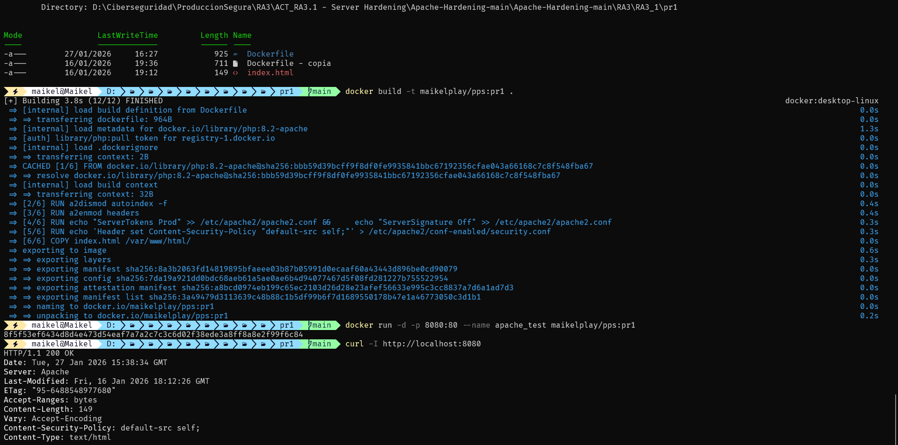
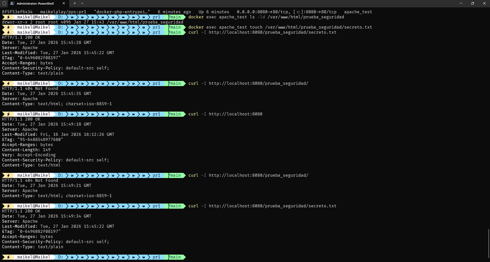

<div align="center">


</div>

<div align="center">


</div>

<div align="center">

[](https://github.com/MaikelPlay/Apache-Hardening)
[](https://hub.docker.com/r/maikelplay/pps)

</div>

# Práctica 1: Hardening de Apache y CSP

Esta práctica se centra en el **endurecimiento (hardening)** de un servidor web Apache corriendo sobre una imagen base de PHP. El objetivo es reducir la superficie de ataque ocultando información sensible del servidor y mitigando ataques de tipo XSS mediante políticas de seguridad de contenidos (CSP).

---

## 📂 Estructura del directorio

El proyecto es autocontenido y simple, gestionando la configuración directamente desde el Dockerfile:

```text
Practica1_Hardening/
├── Dockerfile      # Configuración de seguridad inyectada
└── index.html      # Contenido web de prueba
```

##  Configuración Realizada

Para llegar al estado final de seguridad, se realizaron las siguientes acciones técnicas directamente sobre la configuración de Apache dentro del contenedor:

### 1. Minimización de Información (Security through obscurity)
Para evitar que atacantes identifiquen la versión exacta del servidor y el sistema operativo, se modificó el archivo de configuración global `apache2.conf`:
* **ServerTokens Prod**: Limita la cabecera `Server` a mostrar únicamente "Apache" (sin versiones específicas).
* **ServerSignature Off**: Elimina el pie de página que muestra información del servidor en las páginas de error (404, 500, etc).

### 2. Prevención de Enumeración
* **Deshabilitar autoindex**: Se desactivó el módulo `autoindex` mediante el comando `a2dismod -f autoindex`. Esto impide que, si falta el archivo `index.html` en un directorio, el servidor muestre un listado de todos los archivos y carpetas contenidos en él.

### 3. Cabeceras de Seguridad (CSP)
Se habilitó el módulo `headers` y se inyectó una política de seguridad de contenidos en la configuración:
* **CSP**: `Content-Security-Policy "default-src self;"`.
    * Esta directiva instruye al navegador para que solo ejecute scripts, estilos o imágenes que provengan del **mismo origen** (el propio servidor), bloqueando inyecciones XSS externas y cargas de recursos no autorizados.

---

##  Dockerfile

En esta imagen se puede apreciar cómo se han inyectado las directivas de seguridad paso a paso sobre la imagen base `php:8.2-apache`.


```dockerfile
# 1. HERENCIA: Usamos la imagen oficial actualizada
FROM php:8.2-apache

# 2. LIMPIEZA: Desactivamos el listado de directorios (Autoindex)
RUN a2dismod autoindex -f

# 3. MÓDULOS: Habilitamos el módulo de cabeceras necesario para CSP
RUN a2enmod headers

# 4. OCULTACIÓN: Hardening de información del servidor
RUN echo "ServerTokens Prod" >> /etc/apache2/apache2.conf && \
    echo "ServerSignature Off" >> /etc/apache2/apache2.conf

# 5. POLÍTICA DE SEGURIDAD (CSP)
RUN echo 'Header set Content-Security-Policy "default-src self;"' > /etc/apache2/conf-enabled/security.conf

# 6. CONTENIDO
COPY index.html /var/www/html/

EXPOSE 80
```

## Despliegue (Bash Scripts)
A continuación se muestra el proceso de construcción de la imagen (docker build) y el arranque del contenedor.



### Comandos de Construcción y Ejecución
```bash
# 1. Construir la imagen (Build)
docker build -t maikelplay/pps:pr1 .

# 2. Arrancar el contenedor en segundo plano (puerto 8080)
docker run -d -p 8080:80 --name apache_test maikelplay/pps:pr1
```

##  Validación Técnica
Para comprobar que las políticas de seguridad están activas, se realizaron peticiones curl -I simulando ser un cliente externo.



### Comandos de Verificación Utilizados
```bash
# Verificar cabeceras y versión oculta (Esperado: Server: Apache)
curl -I http://localhost:8080

# Verificar bloqueo de listado de directorios (Esperado: 404 Not Found)
# (Primero creamos una carpeta vacía para probar)
docker exec apache_test mkdir /var/www/html/prueba_seguridad
curl -I http://localhost:8080/prueba_seguridad/

# Verificar acceso a archivos legítimos (Esperado: 200 OK)
docker exec apache_test touch /var/www/html/prueba_seguridad/secreto.txt
curl -I http://localhost:8080/prueba_seguridad/secreto.txt
```

### Análisis de Resultados

* ✅ **Ocultación**: La cabecera Server muestra solo Apache (antes mostraba versión y SO).
* ✅ **CSP Activo**: Se recibe la cabecera Content-Security-Policy: default-src self;.
* ✅ **Autoindex Off**: Al intentar acceder a una carpeta sin index (/prueba_seguridad/), devuelve 404 Not Found en lugar de listar los archivos.


## 🌐 Docker Hub
Imagen disponible para su descarga

| Campo | Valor |
| :--- | :--- |
| **Repositorio** | `maikelplay/pps` |
| **Etiqueta (Tag)** | `pr1` |
| **Comando Pull** | `docker pull maikelplay/pps:pr1` |

---
<div align="center">
    <p>Desarrollado con ❤️ por <b>MaikelPlay</b></p>
    <a href="https://github.com/MaikelPlay">
        
    </a>
    <a href="https://hub.docker.com/u/maikelplay">
        
    </a>
    <a href="https://www.linkedin.com/in/mikel-jordan-moral/">
    
</a>

<a href="https://maikelplay.github.io/portfolio-web/">
    
</a>
</div>
