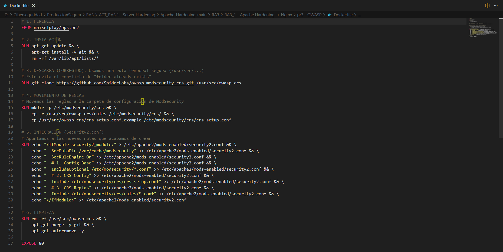
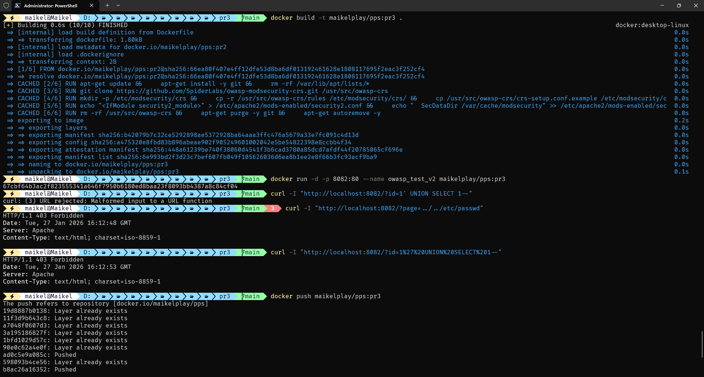
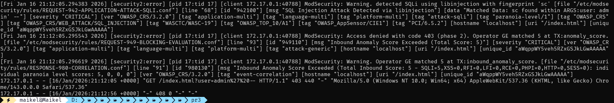

<div align="center">


</div>

<div align="center">


</div>

<div align="center">

[](https://github.com/MaikelPlay/Apache-Hardening)
[](https://hub.docker.com/r/maikelplay/pps)

</div>

# Práctica 3: OWASP Core Rule Set (CRS)

Esta práctica representa el nivel más alto de endurecimiento del servidor. Hemos integrado el **OWASP Core Rule Set (CRS)**, un conjunto de reglas de detección de ataques de código abierto que dota al WAF de "inteligencia" para proteger al servidor contra las vulnerabilidades más críticas (OWASP Top 10), como Inyección SQL y Java Deserialization.

---

## 📂 Estructura del directorio

A diferencia de implementaciones que requieren múltiples archivos de configuración externos, hemos logrado una solución **totalmente autocontenida** en el Dockerfile:

```text
Practica3_OWASP/
└── Dockerfile      # Descarga, configuración e integración de reglas CRS
```

##  Configuración Realizada

Para llegar al estado final del servidor, se realizaron las siguientes acciones técnicas automatizadas:

### A. Implementación del Core Rule Set (CRS)
Se automatizó la descarga desde el repositorio oficial de SpiderLabs/OWASP para garantizar firmas actualizadas:
* **Clonación**: `git clone ... /usr/src/owasp-crs`
* **Despliegue**: Migración de reglas y archivo `crs-setup.conf` al directorio `/etc/modsecurity/crs/`.

### B. Inyección Dinámica de Configuración
En lugar de copiar archivos externos, se modificó el archivo security2.conf en tiempo de construcción (RUN echo ...) para cargar las reglas en el orden correcto:
* **Configuración Base ModSecurity.**
* **Configuración CRS (Setup).**
* **Reglas CRS (*.conf)**.

### C. Optimización de la Imagen
Se implementó una política de limpieza estricta: tras instalar y configurar las reglas, se eliminan git y los archivos temporales, reduciendo drásticamente el tamaño final de la imagen.

---

##  Dockerfile

El siguiente código muestra cómo se integra OWASP CRS sobre la imagen previa (WAF activado) sin dependencias externas.



```dockerfile
# 1. HERENCIA: Partimos de la imagen con WAF activado (Práctica 2)
FROM maikelplay/pps:pr2

# 2. INSTALACIÓN: Necesitamos git para descargar las reglas
RUN apt-get update && \
    apt-get install -y git && \
    rm -rf /var/lib/apt/lists/*

# 3. DESCARGA: Clonamos el Core Rule Set (CRS) oficial
RUN git clone [https://github.com/SpiderLabs/owasp-modsecurity-crs.git](https://github.com/SpiderLabs/owasp-modsecurity-crs.git) /usr/src/owasp-crs

# 4. MOVIMIENTO DE REGLAS: Organizo las carpetas en /etc/modsecurity
RUN mkdir -p /etc/modsecurity/crs && \
    cp -r /usr/src/owasp-crs/rules /etc/modsecurity/crs/ && \
    cp /usr/src/owasp-crs/crs-setup.conf.example /etc/modsecurity/crs/crs-setup.conf

# 5. INTEGRACIÓN: Configuro Apache dinámicamente para leer las reglas
RUN echo "<IfModule security2_module>" > /etc/apache2/mods-enabled/security2.conf && \
    echo "  SecDataDir /var/cache/modsecurity" >> /etc/apache2/mods-enabled/security2.conf && \
    echo "  SecRuleEngine On" >> /etc/apache2/mods-enabled/security2.conf && \
    echo "  # Carga de Reglas OWASP" >> /etc/apache2/mods-enabled/security2.conf && \
    echo "  Include /etc/modsecurity/crs/crs-setup.conf" >> /etc/apache2/mods-enabled/security2.conf && \
    echo "  Include /etc/modsecurity/crs/rules/*.conf" >> /etc/apache2/mods-enabled/security2.conf && \
    echo "</IfModule>" >> /etc/apache2/mods-enabled/security2.conf

# 6. LIMPIEZA
RUN rm -rf /usr/src/owasp-crs && apt-get purge -y git && apt-get autoremove -y

EXPOSE 80
```

## Despliegue
Proceso de construcción (pr3) y arranque en el puerto 8082.



### Comandos de Construcción y Ejecución
```bash
# 1. Construir la imagen con reglas OWASP
docker build -t maikelplay/pps:pr3 .

# 2. Arrancar en puerto 8082
docker run -d -p 8082:80 --name owasp_test_v2 maikelplay/pps:pr3
```

##  Validación y Auditoría
Se han ejecutado pruebas de penetración reales para confirmar que el conjunto de reglas OWASP bloquea patrones de ataque complejos.

### 1. Tabla de Pruebas Realizadas

| Tipo de ataque | Payload (Carga) | Respuesta | Regla Activada (Log) |
| :--- | :--- | :--- | :--- |
| **SQL Injection (Básico)** | `?id=1' UNION SELECT 1--` | **403 Forbidden** | SQL Injection Attack Detected |
| **SQL Injection (Complejo)** | `?id=1 UNION SELECT database()` | **403 Forbidden** | OWASP_CRS/WEB_ATTACK/SQL_INJECTION |
| **Path Traversal** | `?page=../../etc/passwd` | **403 Forbidden** | Inbound Anomaly Score Exceeded |

### 2. Evidencia de Logs (Auditoría)
En la siguiente captura se observa cómo ModSecurity detecta la inyección SQL, la clasifica como CRITICAL y aplica el bloqueo.



### 3. Evidencia Visual (Navegador)
El navegador muestra el bloqueo efectivo al intentar inyectar comandos SQL en la URL.


## 🌐 Docker Hub
Imagen disponible para su descarga

| Campo | Valor |
| :--- | :--- |
| **Repositorio** | `maikelplay/pps` |
| **Etiqueta (Tag)** | `pr3` |
| **Comando Pull** | `docker pull maikelplay/pps:pr3` |

---
<div align="center">
    <p>Desarrollado con ❤️ por <b>MaikelPlay</b></p>
    <a href="https://github.com/MaikelPlay">
        
    </a>
    <a href="https://hub.docker.com/u/maikelplay">
        
    </a>
    <a href="https://www.linkedin.com/in/mikel-jordan-moral/">
    
</a>

<a href="https://maikelplay.github.io/portfolio-web/">
    
</a>
</div>
