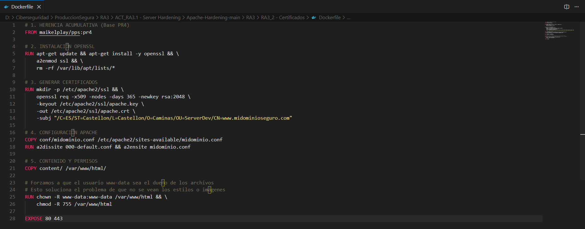
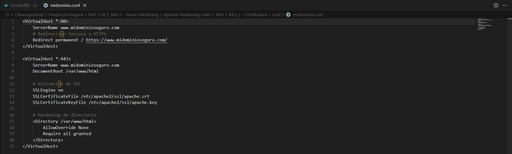
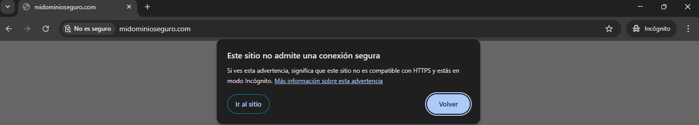

<div align="center">


</div>

<div align="center">


</div>

<div align="center">

[](https://github.com/MaikelPlay/Apache-Hardening)
[](https://hub.docker.com/r/maikelplay/pps)

</div>

# Práctica 6: Certificados SSL/TLS en Apache

En esta práctica implementamos la capa de **Confidencialidad** mediante el cifrado de las comunicaciones. Configuramos Apache para soportar HTTPS utilizando certificados autofirmados generados con OpenSSL, forzando la redirección de todo el tráfico inseguro (HTTP) al canal seguro (HTTPS).

---

## 📂 Estructura del directorio

Necesitamos inyectar la configuración del VirtualHost y los certificados en el contenedor:

```text
Practica6_Certificados/
├── Dockerfile          # Generación de certificados y configuración
├── conf/
│   └── midominio.conf  # VirtualHost con redirección y SSL
└── content/            # Web de prueba
```

## Configuración Realizada

Esta práctica aplica el principio de **Defensa en Profundidad**, heredando todas las capas de seguridad previas (WAF ModSecurity, Reglas OWASP, Anti-DDOS) de la imagen `maikelplay/pps:pr4` y añadiendo la capa de **Confidencialidad** (SSL/TLS).

Se han realizado las siguientes acciones técnicas:

### 1. Habilitación de Criptografía
* **Módulos**: Se habilitó el módulo SSL de Apache (`a2enmod ssl`) y se instaló `openssl` para la gestión de claves.
* **Estructura**: Se creó el directorio protegido `/etc/apache2/ssl` para alojar las claves privadas y los certificados públicos.

### 2. Generación de Certificados (OpenSSL)
Se generó un par de claves (Pública/Privada) autofirmadas con las siguientes características robustas:
* **Algoritmo**: RSA de 2048 bits (`rsa:2048`).
* **Validez**: 365 días (`-days 365`).
* **Identidad (Subject)**:
    * **CN (Common Name)**: `www.midominioseguro.com`
    * **O (Organización)**: `Caminas`
    * **OU (Unidad)**: `ServerDev`
    * **Lugar**: `Castellon`

### 3. Configuración del VirtualHost (`midominio.conf`)
Se definió una política de tráfico estricta dividida en dos bloques:
* **Puerto 80 (HTTP)**: Actúa únicamente como puerta de enlace para redirigir tráfico. Se configuró `Redirect permanent / https://...` para forzar a todos los usuarios a usar el canal seguro.
* **Puerto 443 (HTTPS)**:
    * **SSLEngine On**: Activa el motor de cifrado.
    * **Rutas**: Apunta a `apache.crt` y `apache.key`.
    * **Hardening**: Se restringió el acceso al directorio raíz (`AllowOverride None`) para evitar configuraciones inseguras mediante `.htaccess`.

### 4. Gestión de Permisos
Para evitar errores de "Forbidden" al servir contenido estático y asegurar que el usuario del servidor web tenga control total sobre los archivos, se ejecutó:
* `chown -R www-data:www-data /var/www/html`.

---

## Dockerfile y Configuración

La infraestructura se define mediante el archivo de construcción y la configuración del sitio virtual.

### 1. El Dockerfile
Automatiza la instalación de herramientas criptográficas (OpenSSL), la generación de claves, la configuración de Apache y el ajuste de permisos.



```dockerfile
# 1. HERENCIA ACUMULATIVA (Base PR4)
# Partimos de la imagen que ya tiene Anti-DDOS y WAF
FROM maikelplay/pps:pr4

# 2. INSTALACIÓN OPENSSL
# Instalamos openssl y activamos el módulo SSL de Apache
RUN apt-get update && apt-get install -y openssl && \
    a2enmod ssl && \
    rm -rf /var/lib/apt/lists/*

# 3. GENERAR CERTIFICADOS
# Creamos la carpeta y generamos el certificado autofirmado (365 días)
RUN mkdir -p /etc/apache2/ssl && \
    openssl req -x509 -nodes -days 365 -newkey rsa:2048 \
    -keyout /etc/apache2/ssl/apache.key \
    -out /etc/apache2/ssl/apache.crt \
    -subj "/C=ES/ST=Castellon/L=Castellon/O=Caminas/OU=ServerDev/CN=[www.midominioseguro.com](https://www.midominioseguro.com)"

# 4. CONFIGURACIÓN APACHE
# Copiamos nuestra config personalizada y desactivamos la por defecto
COPY conf/midominio.conf /etc/apache2/sites-available/midominio.conf
RUN a2dissite 000-default.conf && a2ensite midominio.conf

# 5. CONTENIDO Y PERMISOS
# Copiamos la web y aseguramos que www-data sea el dueño
COPY content/ /var/www/html/
RUN chown -R www-data:www-data /var/www/html && \
    chmod -R 755 /var/www/html

EXPOSE 80 443
```

### 2. Configuración del VirtualHost (`midominio.conf`)
Define las reglas de tráfico: redirige todo lo que entre por el puerto 80 hacia el 443, y configura el cifrado en el puerto seguro.



```apache

<VirtualHost *:80>
    ServerName [www.midominioseguro.com](https://www.midominioseguro.com)
    # Redirección forzosa a HTTPS
    Redirect permanent / [https://www.midominioseguro.com/](https://www.midominioseguro.com/)
</VirtualHost>

<VirtualHost *:443>
    ServerName [www.midominioseguro.com](https://www.midominioseguro.com)
    DocumentRoot /var/www/html

    # Activación de SSL
    SSLEngine on
    SSLCertificateFile /etc/apache2/ssl/apache.crt
    SSLCertificateKeyFile /etc/apache2/ssl/apache.key

    # Hardening de directorio
    <Directory /var/www/html>
        AllowOverride None
        Require all granted
    </Directory>
</VirtualHost>

```

## Despliegue

Construcción (pr6) y arranque mapeando el puerto 443.


### Comandos de Construcción y Ejecución
```bash
# 1. Construir la imagen
docker build -t maikelplay/pps:pr6 .

# 2. Arrancar contenedor (Puertos 80 y 443)
docker run -d -p 80:80 -p 443:443 --name apache_ssl maikelplay/pps:pr6
```

## Validación Técnica

Para verificar el correcto despliegue de la infraestructura de clave pública (PKI) y la configuración del servidor web, se realizaron las siguientes comprobaciones utilizando un navegador web configurado para resolver el dominio local.

### 1. Verificación de Datos del Certificado
Se inspeccionó el certificado digital servido por Apache para asegurar que coincide con los parámetros definidos durante la construcción de la imagen Docker.
* **Resultado**: El certificado muestra correctamente los campos de Organización (`O=Caminas`) y Unidad Organizativa (`OU=ServerDev`), confirmando que la generación con OpenSSL fue exitosa.


### 2. Establecimiento de Conexión Segura (HTTPS)
Se accedió al dominio `https://www.midominioseguro.com`.
* **Resultado**: El navegador muestra el candado de seguridad y confirma "Conexión segura". Esto indica que el intercambio de claves (Handshake TLS) se ha realizado correctamente y que el tráfico entre el cliente y el servidor está cifrado en el puerto 443.


### 3. Redirección Forzosa y Advertencia de Seguridad
Se intentó acceder al sitio mediante el protocolo inseguro HTTP (`http://www.midominioseguro.com`).
* **Resultado**: El servidor ejecutó la directiva `Redirect permanent` (Código 301), forzando al navegador a cambiar al protocolo HTTPS.
* **Nota**: Al tratarse de un certificado autofirmado (no emitido por una CA pública como Let's Encrypt), el navegador muestra inicialmente una advertencia de seguridad, comportamiento esperado que valida que el navegador está verificando la firma del certificado.




## 🌐 Docker Hub
Imagen disponible para su descarga

| Campo | Valor |
| :--- | :--- |
| **Repositorio** | `maikelplay/pps` |
| **Etiqueta (Tag)** | `pr6` |
| **Comando Pull** | `docker pull maikelplay/pps:pr6` |

---
<div align="center">
    <p>Desarrollado con ❤️ por <b>MaikelPlay</b></p>
    <a href="https://github.com/MaikelPlay">
        
    </a>
    <a href="https://hub.docker.com/u/maikelplay">
        
    </a>
    <a href="https://www.linkedin.com/in/mikel-jordan-moral/">
    
</a>

<a href="https://maikelplay.github.io/portfolio-web/">
    
</a>
</div>
