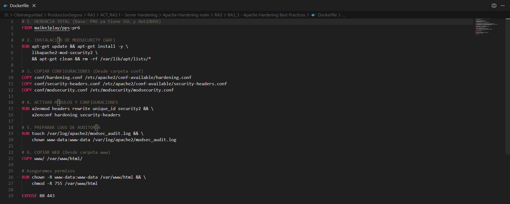
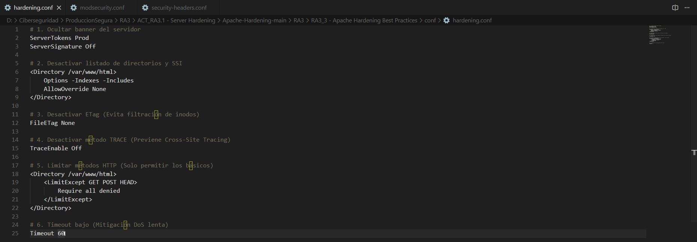
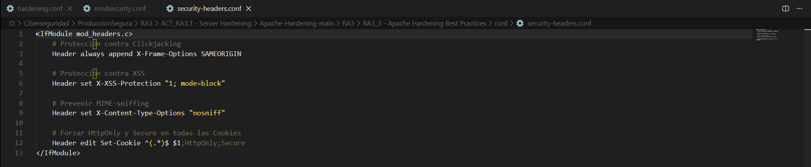
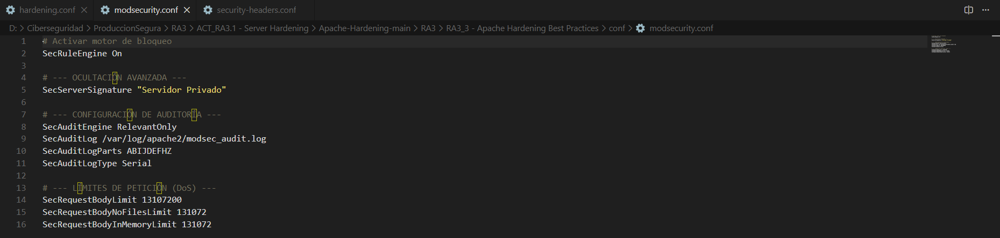
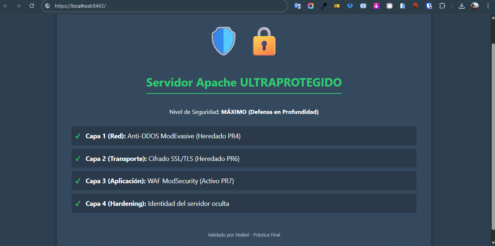

<div align="center">


</div>

<div align="center">


</div>

<div align="center">

[](https://github.com/MaikelPlay/Apache-Hardening)
[](https://hub.docker.com/r/maikelplay/pps)

</div>

# Práctica 7: Apache Hardening Best Practices

Esta práctica final consolida todas las técnicas aprendidas implementando una estrategia de **Defensa en Profundidad**. Partiendo de una base que ya cuenta con SSL y protección Anti-DDoS, aplicamos configuraciones avanzadas de endurecimiento (Hardening) para minimizar la superficie de ataque, controlar cabeceras HTTP, restringir métodos y ofuscar la identidad del servidor.

---

## 📂 Estructura del directorio

Para mantener el orden y la modularidad, separamos las configuraciones en archivos específicos dentro de la carpeta `conf/`:

```text
Practica7_Hardening/
├── Dockerfile              # Orquestación de la imagen final
├── conf/
│   ├── hardening.conf      # Restricciones de métodos, directorios y banners
│   ├── security-headers.conf # Cabeceras HTTP de seguridad (XSS, Frame, Cookies)
│   └── modsecurity.conf    # Ajustes del WAF y auditoría
└── www/                    # Sitio web de prueba (Landing Page)
```

## Configuración Realizada

En esta etapa final implementamos el concepto de **Defensa en Profundidad**, inyectando tres capas de configuración granular directamente en el servidor Apache. Estas configuraciones se han modularizado en archivos `.conf` para mantener el orden y la escalabilidad.

### 1. Hardening del Core (`hardening.conf`)
Este archivo contiene directivas para reducir la huella digital del servidor y mitigar vectores de ataque básicos:

* **Ocultación de Banner**:
    * `ServerTokens Prod`: Reduce la cabecera `Server` a enviar solo "Apache", sin versiones ni SO.
    * `ServerSignature Off`: Elimina la firma del servidor en las páginas de error generadas.
* **Restricción de Directorios y Ficheros**:
    * `Options -Indexes -Includes`: Deshabilita el listado de directorios (evita enumeración) y los *Server Side Includes*.
    * `AllowOverride None`: Bloquea el uso de archivos `.htaccess`, centralizando la seguridad en la configuración principal y mejorando el rendimiento.
    * `FileETag None`: Evita la filtración de inodos del sistema de archivos.
* **Control de Métodos HTTP**:
    * Se utiliza `<LimitExcept GET POST HEAD>` para denegar explícitamente cualquier otro método (como PUT, DELETE o TRACE), reduciendo la superficie de ataque.
    * `TraceEnable Off`: Deshabilita el método TRACE para prevenir ataques de *Cross-Site Tracing* (XST).
* **Mitigación DoS Lenta**:
    * `Timeout 60`: Se reduce el tiempo de espera para liberar conexiones más rápido ante ataques de *Slowloris*.

### 2. Cabeceras de Seguridad (`security-headers.conf`)
Se inyectan cabeceras HTTP estrictas para proteger al cliente (navegador) contra ataques del lado del cliente:

* **Anti-Clickjacking**: `X-Frame-Options SAMEORIGIN` impide que la web sea incrustada en *iframes* de sitios externos.
* **Anti-XSS**: `X-XSS-Protection "1; mode=block"` activa los filtros XSS de los navegadores antiguos.
* **Anti-Sniffing**: `X-Content-Type-Options "nosniff"` fuerza al navegador a respetar el tipo MIME declarado por el servidor, evitando ejecuciones de código malicioso camuflado.
* **Protección de Cookies**: Se utiliza `Header edit Set-Cookie` para asegurar que todas las cookies tengan los atributos `HttpOnly` (inaccesibles por JS) y `Secure` (solo viajan por HTTPS).

### 3. Ajuste WAF y Auditoría (`modsecurity.conf`)
Se refina la configuración del cortafuegos de aplicación para mejorar la auditoría y el control:

* **Modo de Bloqueo**: `SecRuleEngine On` asegura la intercepción activa de ataques.
* **Ofuscación**: `SecServerSignature "Servidor Privado"` altera la firma del servidor para confundir a escáneres automatizados.
* **Auditoría Forense**:
    * `SecAuditEngine RelevantOnly`: Solo registra transacciones que generan alertas o errores (evita ruido en los logs).
    * `SecAuditLog`: Define la ruta específica `/var/log/apache2/modsec_audit.log` para centralizar la evidencia de ataques.
* **Límites de Petición (DoS)**: Se establecen límites de memoria (`SecRequestBodyInMemoryLimit`) y tamaño de ficheros para prevenir desbordamientos de buffer o denegaciones de servicio por consumo de recursos.

---

## Dockerfile y Configuración

El archivo de construcción (`Dockerfile`) es el orquestador final que consolida todas las capas de seguridad.

### 1. El Dockerfile
Este script automatiza la creación de la imagen "Ultraprotegida", heredando de la práctica anterior (SSL) e inyectando las configuraciones avanzadas de hardening y auditoría.



```dockerfile
# 1. HERENCIA TOTAL (Base: PR6 ya tiene SSL y AntiDDOS)
FROM maikelplay/pps:pr6

# 2. INSTALACIÓN DE MODSECURITY (WAF)
# Aseguramos que el módulo esté presente y actualizado
RUN apt-get update && apt-get install -y \
    libapache2-mod-security2 \
    && apt-get clean && rm -rf /var/lib/apt/lists/*

# 3. COPIAR CONFIGURACIONES (Modularidad)
COPY conf/hardening.conf /etc/apache2/conf-available/hardening.conf
COPY conf/security-headers.conf /etc/apache2/conf-available/security-headers.conf
COPY conf/modsecurity.conf /etc/modsecurity/modsecurity.conf

# 4. ACTIVAR MÓDULOS Y CONFIGURACIONES
RUN a2enmod headers rewrite unique_id security2 && \
    a2enconf hardening security-headers

# 5. PREPARAR LOGS DE AUDITORÍA
# Creamos el archivo y asignamos permisos al usuario de Apache
RUN touch /var/log/apache2/modsec_audit.log && \
    chown www-data:www-data /var/log/apache2/modsec_audit.log

# 6. COPIAR WEB FINAL
COPY www/ /var/www/html/

# Aseguramos permisos correctos
RUN chown -R www-data:www-data /var/www/html && \
    chmod -R 755 /var/www/html

EXPOSE 80 443
```

### 2. Configuraciones Clave

A continuación se detallan los archivos de configuración inyectados en el contenedor, los cuales definen el nivel de seguridad "Ultraprotegido".

#### A. Hardening General (`hardening.conf`)
Define las restricciones a nivel de servidor: oculta la versión de Apache, deshabilita el listado de directorios, prohíbe el uso de `.htaccess` (mejora rendimiento y seguridad) y limita los métodos HTTP permitidos a solo los esenciales.



```apache
# 1. Ocultar banner del servidor (Solo muestra "Apache")
ServerTokens Prod
ServerSignature Off

# 2. Desactivar listado de directorios y SSI
<Directory /var/www/html>
    Options -Indexes -Includes
    AllowOverride None
</Directory>

# 3. Desactivar ETag (Evita filtración de inodos)
FileETag None

# 4. Desactivar método TRACE (Previene Cross-Site Tracing)
TraceEnable Off

# 5. Limitar métodos HTTP (Solo permitir los básicos)
<Directory /var/www/html>
    <LimitExcept GET POST HEAD>
        Require all denied
    </LimitExcept>
</Directory>

# 6. Timeout bajo (Mitigación DoS lenta)
Timeout 60
```

#### B. Cabeceras de Seguridad (`security-headers.conf`)
Inyecta cabeceras HTTP en todas las respuestas para proteger el navegador del cliente contra ataques de XSS, Clickjacking y robo de cookies.



```apache
<IfModule mod_headers.c>
    # Protección contra Clickjacking
    Header always append X-Frame-Options SAMEORIGIN

    # Protección contra XSS
    Header set X-XSS-Protection "1; mode=block"

    # Prevenir MIME-sniffing
    Header set X-Content-Type-Options "nosniff"

    # Forzar HttpOnly y Secure en todas las Cookies
    # Esto asegura que las cookies no sean accesibles por JS y solo viajen por HTTPS
    Header edit Set-Cookie ^(.*)$ $1;HttpOnly;Secure
</IfModule>
```

#### C. Ajustes WAF y Auditoría (modsecurity.conf)
Configura el motor ModSecurity en modo bloqueo, establece la firma falsa del servidor para despistar a atacantes y define la ruta centralizada de los logs de auditoría.



```apache
# Activar motor de bloqueo
SecRuleEngine On

# --- OCULTACIÓN AVANZADA ---
# Cambiamos la firma del servidor para confundir escáneres
SecServerSignature "Servidor Privado"

# --- CONFIGURACIÓN DE AUDITORÍA ---
# Solo registramos eventos relevantes (Alertas/Errores)
SecAuditEngine RelevantOnly
SecAuditLog /var/log/apache2/modsec_audit.log
SecAuditLogParts ABIJDEFHZ
SecAuditLogType Serial

# --- LÍMITES DE PETICIÓN (DoS) ---
# Prevención de desbordamientos de buffer y consumo excesivo
SecRequestBodyLimit 13107200
SecRequestBodyNoFilesLimit 131072
SecRequestBodyInMemoryLimit 131072
```

## Despliegue

Construcción de la imagen final (pr7) y despliegue en puertos 8085 (HTTP) y 8443 (HTTPS).


### Comandos de Construcción y Ejecución
```bash
# 1. Construir la imagen final
docker build -t maikelplay/pps:pr7 .

# 2. Arrancar el contenedor "Ultraprotegido"
docker run -d -p 8085:80 -p 8443:443 --name apache_final maikelplay/pps:pr7
```

## Validación Técnica

La validación final se centra en comprobar que la estrategia de **Defensa en Profundidad** funciona como un conjunto cohesivo, donde cada capa cubre las carencias de la anterior.

### 1. Verificación Visual de Capas
Al acceder a la página de inicio del servidor (`https://localhost:8443`), se despliega una landing page de diagnóstico que confirma el estado activo de todas las protecciones implementadas a lo largo de las prácticas.



**Análisis del Estado:**
* ✅ **Capa 1 (Red):** Protección Anti-DDoS (ModEvasive) activa y heredada.
* ✅ **Capa 2 (Transporte):** Túnel cifrado SSL/TLS heredado.
* ✅ **Capa 3 (Aplicación):** WAF ModSecurity en modo bloqueo (SecRuleEngine On).
* ✅ **Capa 4 (Hardening):** Identidad del servidor ofuscada y cabeceras estrictas.

### 2. Certificado y Confidencialidad
Se verifica que, a pesar de las nuevas restricciones de hardening, la configuración SSL sigue intacta y el servidor entrega el certificado correcto para `www.midominioseguro.com`.


### 3. Prueba de Intrusión (WAF Activo)
Para confirmar que el *Hardening* y el *WAF* trabajan juntos, simulamos un ataque de **Path Traversal** intentando leer el archivo de contraseñas del sistema (`/etc/passwd`) a través de un parámetro URL.

**Prueba:**
```bash
https://localhost:8443/?file=../../etc/passwd
```

**Resultado:**
El servidor intercepta el patrón de ataque y devuelve un código de estado 403 Forbidden. A diferencia de un servidor estándar, este mensaje de error no revela la versión de Apache ni el sistema operativo (gracias a `ServerTokens Prod` y `ServerSignature Off`), denegando información útil al atacante


## 🌐 Docker Hub
Imagen disponible para su descarga

| Campo | Valor |
| :--- | :--- |
| **Repositorio** | `maikelplay/pps` |
| **Etiqueta (Tag)** | `pr7` |
| **Comando Pull** | `docker pull maikelplay/pps:pr7` |

---
<div align="center">
    <p>Desarrollado con ❤️ por <b>MaikelPlay</b></p>
    <a href="https://github.com/MaikelPlay">
        
    </a>
    <a href="https://hub.docker.com/u/maikelplay">
        
    </a>
    <a href="https://www.linkedin.com/in/mikel-jordan-moral/">
    
</a>

<a href="https://maikelplay.github.io/portfolio-web/">
    
</a>
</div>
